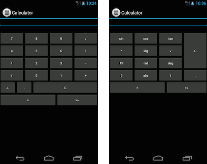

The Calculator Application
===========

This application is a simple Android Calculator application that has two modes: Simple and
Scientific mode. Each mode is represented by an Activity.

This application illustrates JPF-Android input script and how it can be used to drive the execution of the application on JPF. 

The application can be used to detect an Arithmetic exception, using jpf-android, that is thrown by the application when we divide by zero or ask for the square root of a negative number. Lastly it can detect a NullPointer dereferencing exception when sending data between Activities.



Dependencies
-----------

For the application to compile and run the following is required: 

 - The project makes use of [EvalEx](https://github.com/uklimaschewski/EvalEx), a Java Expression Evaluator to parse and evaluate expressions. This library needs to be downloaded, packaged into a jar and placed in the libs folder of the application. (Since there is no jar availble this is currently included. In future releases we will download this using gradle)

 - The project also depends on the jpf-android Checkpoint annotation package found in `jpf-android-annotaions.jar` file generated by jpf-android during the `src-dist` gradle task. The idea is also not to include this jar, but to download the current version from a online maven repo (future plans). For now it is included in the libs folder.


Building
--------
Although this project has the old Java application package structure used by the Android Eclipse plugin, the tool also makes use of both `gradle` and/or `ant` for building the project. 

####Eclipse

 1. Install the [Android ADT plugin](http://developer.android.com/sdk) for Eclipse and download Android SDK 19 & Build Tools 19.0.2.

 2. For the application to be built in Eclipse, you need to create a `local.properties` file in the project directory containing the location of the Android SDK:

	`sdk.dir=<path>`

 5. Generate the Eclipse project files using gradle (I could have included these in the project directory, but I prefer to generate them):

	```
	~$ ./gradlew build

	~$ ./gradlew cleanEclipse eclipse
	```
 

 6. Import the Calculator Android project into Eclipse as an **Android application**.

 
####Command line

Download the Android ADT and use the `android`  tool in the `../adt/tools` directory to install Android SDK 19 & Build Tools 19.0.2. This is used to build the Android application.


The `gradle` wrapper provided must be used to build the project as we require gradle version 1.10. To build and install the application run:

```
~$ chmod +x gradlew
~$ ./gradlew build
```

This will generate a `build` directory under the project root containing the compiled code.

The project can also be built using ant:

```
# generate the android build.xml file
~$ android update project -p .

# build
~$ ant clean release
```

Running
-----

This project can either be executed as an Android application or it can be verified on JPF-Android.

####Running as an Android application

**Eclipse:**

Right Click on project and select `Run As`->`Android Application`.

**Command line:**

Make sure the android tools directory is in your path:

```sh
# Start the emulator
android avd

# install app on the emulator
./gradlew installDebug

```


####Running on JPF-Android

Install and build JPF-Core, JPF-nhander and JPF-Android, see [here](http://heila.bitbucket.org/jpf-android/installation.html) for instructions.

**Eclipse**

The simplest way to run JPF-Android is to use the jpf eclipse plug-in from [here](http://babelfish.arc.nasa.gov/trac/jpf/wiki/install/eclipse-plugin)
            
Right click on a .jpf file. Select the Verify option and the verification process of the system specified in the .jpf file begins.


**Command Line**

To run a project built with gradle, we first need to update the `classpath` in all the `*.jpf` property files of the project. Currently the classpath will point to `project/bin/classes` (used by ant), but gradle makes use of the `/build/classes/release` directory:

```sh
#classpath+=${jpf-android}/../Applications/Calculator/bin/classes/;${jpf-android}/../Applications/Calculator/libs/EvalEx-1.0.jar;

classpath+=${jpf-android}/../Applications/Calculator/build/classes/release;${jpf-android}/../Applications/Calculator/libs/EvalEx-1.0.jar;
```

###Future:

** Running monkeyrunner tests: **

** Running UI Automator tests: **

** Running JUnit tests: **

** Translating JPF-core script to monkeyrunner: **


Common Issues
--------------
**Problem:**
```
FAILURE: Build failed with an exception.
 
* What went wrong:
Could not determine the dependencies of task ':compileDebugJava'.
> failed to find Build Tools revision 19.0.2
 
* Try:
Run with --stacktrace option to get the stack trace. Run with --info or --debug option to get more log output.
 
BUILD FAILED
```

**Solution:**
Please install the Android build tools version 19.0.2 using the Android sdk manager.

**Problem:**
When running JPF:
```
Executing command: java -jar ~/jpf-core/build/RunJPF.jar +shell.port=4242 Calculator/src/TestCalculator_NoErr.jpf 
...
...
[WARNING] unknown classpath element: ~/jpf-android/jpf-android/build/jpf-android-classes.jar
[WARNING] unknown classpath element: ~/jpf-android/jpf-android/build/examples
...
...
[INFO] VMListener added: gov.nasa.jpf.report.Statistics@38b4216d
[INFO] SearchListener added: gov.nasa.jpf.report.Statistics@38b4216d
[SEVERE] JPF configuration error: class not found gov.nasa.jpf.jvm.InjectMainListener
[SEVERE] JPF terminated
```

**Solution:**
JPF-Android was not built. A similar exception will be thrown if JPF-nhandler or JPF-core was not built before running JPF.

**Problem:**
When running JPF:
```
Executing command: java -jar ~/jpf-core/build/RunJPF.jar +shell.port=4242 Calculator/src/TestCalculator_NoErr.jpf 
...
...
[INFO] VMListener added: gov.nasa.jpf.jvm.InjectMainListener@563e4d49
[INFO] SearchListener added: gov.nasa.jpf.jvm.InjectMainListener@563e4d49
[INFO] VMListener added: gov.nasa.jpf.listener.CoverageAnalyzer@14441fdb
[INFO] SearchListener added: gov.nasa.jpf.listener.CoverageAnalyzer@14441fdb
[SEVERE] cannot load application class com.example.calculator.SimpleActivity
```

**Solution:**
The Calculator example was not built before running JPF-Android or the classpath in the *.jpf was not updated. The classpath depends on which build tool was used to build the Calculator example. Please see the Running on JPF-Android section under the Command line section.


License
-------

This software is distributed under the terms of the Apache Software License 2.0.
See the LICENSE file for further details.
